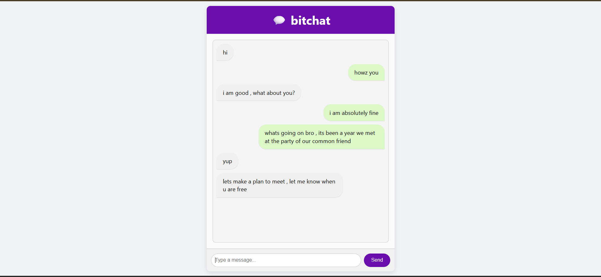

# 💬 bitchat

A simple real-time chat application built with **Node.js**, **Express**, and **Socket.io**. Messages are sent instantly across connected users with a clean, scrollable chat UI.



---

## 🚀 Features

- Real-time messaging using WebSockets
- User messages appear instantly
- Messages from other users show separately
- Smooth auto-scrolling chat window
- Fixed-height chat area with scroll
- Clean and responsive UI (mobile-friendly optional)

---

## 📁 Project Structure

```
bitchat/
├── index.js                # Node.js + Express + Socket.io server
├── public/
│   ├── index.html          # Chat frontend
│   ├── style.css           # Styling
│   └── socket.io.js        # Loaded automatically by Socket.io
├── package.json
└── README.md               # This file
```

---

## 🛠️ Installation & Setup

1. **Clone the repository**

   ```bash
   git clone https://github.com/yourusername/bitchat.git
   cd bitchat
   ```

2. **Install dependencies**

   ```bash
   npm install
   ```

3. **Start the server**

   ```bash
   node index.js
   ```

4. **Visit the app**
   Open your browser and go to:
   ```
   http://localhost:9000
   ```

---

## 📦 Dependencies

- [Express](https://expressjs.com/)
- [Socket.io](https://socket.io/)

Install them via:

```bash
npm install express socket.io
```

---

## 📸 UI Preview

- Left-side messages: Incoming from other users (`received`)
- Right-side messages: Sent by you (`sent`)
- Chat box scrolls automatically on new messages

---

## 🧠 How It Works

- The client emits `"a message"` using `socket.emit(...)`.
- Server listens to `"a message"` and `broadcast.emit()`s it to other clients.
- Each client listens for `"message"` and renders it dynamically in the UI.

---

## 📌 TODO / Ideas

- Add usernames / user sessions
- Show join/leave notifications
- Support emojis, file sharing
- Add typing indicators
- Deploy to [Vercel](https://vercel.com), [Render](https://render.com), or [Heroku](https://www.heroku.com)

---

## 🧑‍💻 Author

**Tushar Verma**
